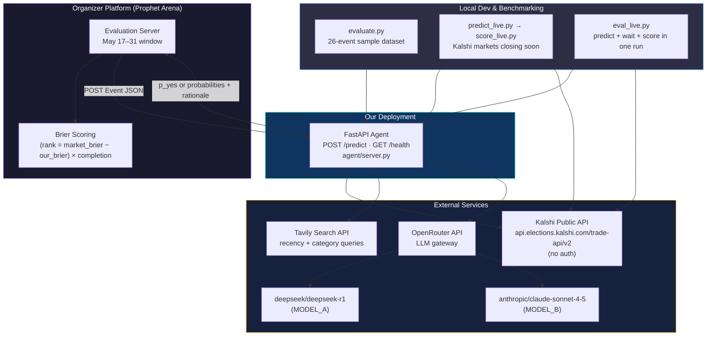
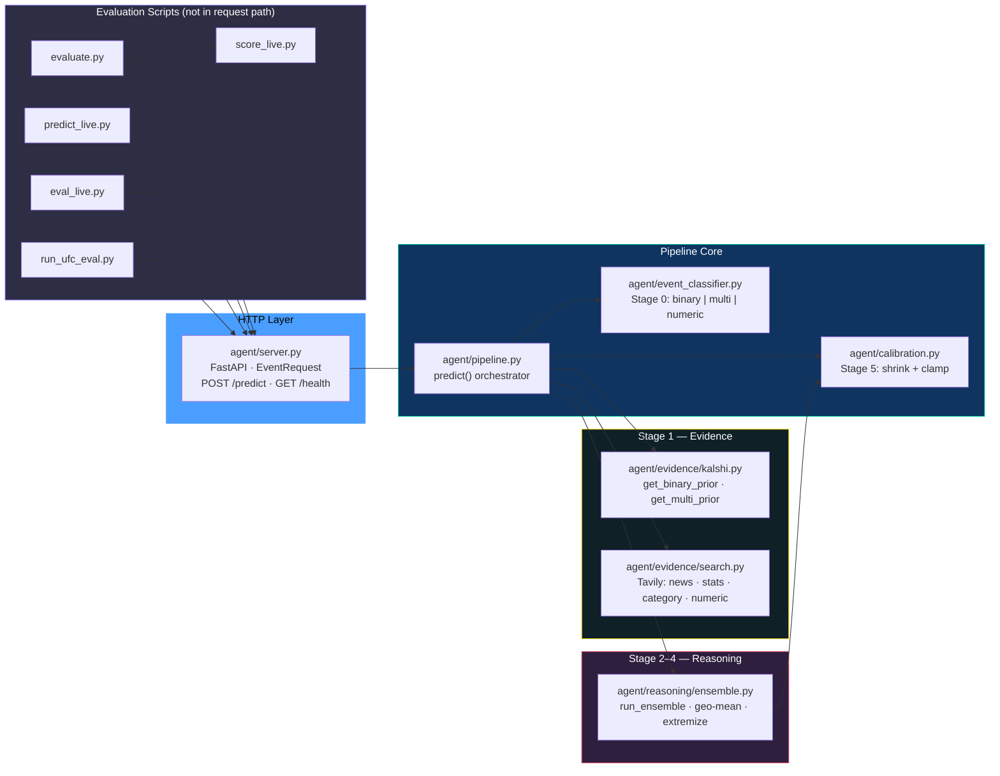
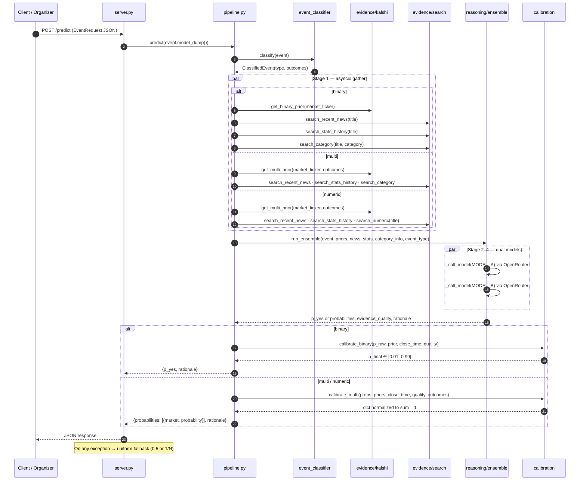
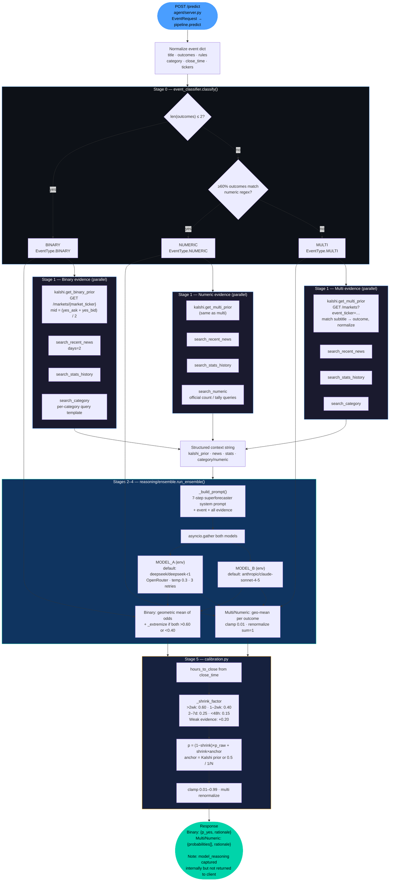
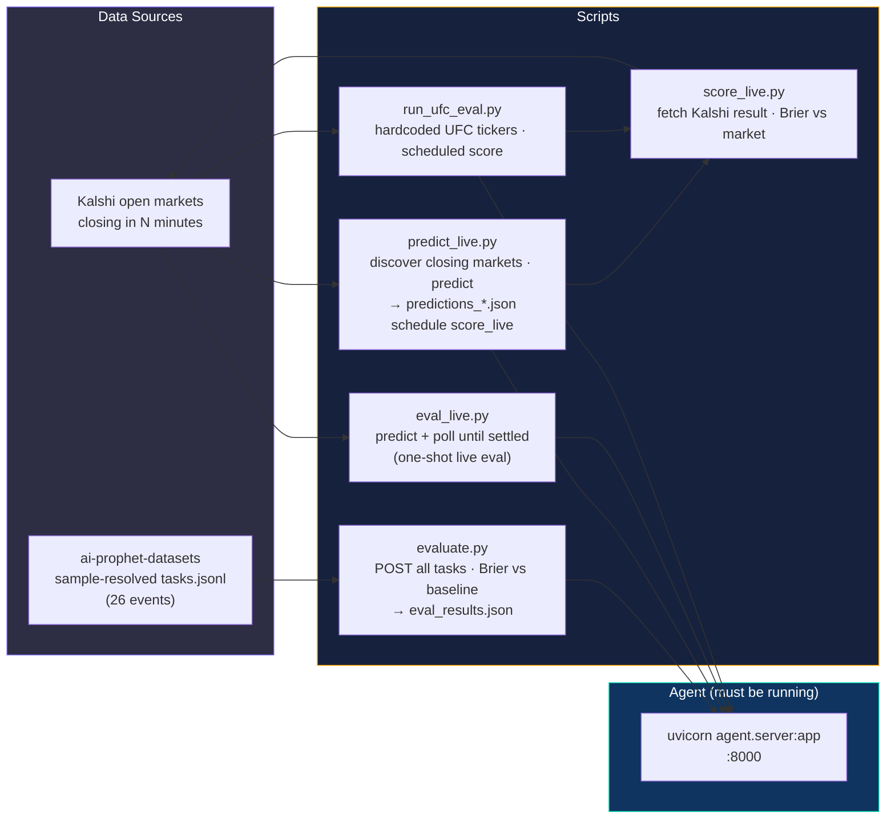

# AI-Prophets Forecasting Agent — Architecture

> Paste any Mermaid block into **[mermaid.live](https://mermaid.live)** to render.
> Last updated from codebase evaluation: May 2026.

---

## 1. System Context

How the agent fits in the Prophet Hacks forecasting competition and which external systems it talks to.



---

## 2. Repository Layout & Module Map



---

## 3. Request Lifecycle (Sequence)

End-to-end path for a single `POST /predict` call.



---

## 4. Prediction Pipeline (Detailed Flow)

Implementation-accurate view of all stages. **Numeric events** share the multi-outcome ensemble path; they differ only in Stage 1 search (`search_numeric` instead of `search_category`).



---

## 5. Evaluation & Offline Tooling

Scripts used during development; none are invoked by the production `/predict` handler.



---

## 6. External API Contracts

| Integration | Endpoint / SDK | Auth | Used by |
|---|---|---|---|
| Kalshi markets | `GET …/trade-api/v2/markets/{ticker}` | None | `kalshi.get_binary_prior`, live scoring |
| Kalshi event markets | `GET …/markets?event_ticker=&status=open` | None | `kalshi.get_multi_prior`, `predict_live` |
| Tavily search | `AsyncTavilyClient.search()` | `TAVILY_API_KEY` | `evidence/search.py` (4 query types) |
| OpenRouter chat | `https://openrouter.ai/api/v1` | `OPENROUTER_API_KEY` | `ensemble._call_model` |
| Prophet Arena | Organizer → our `POST /predict` | `PA_SERVER_API_KEY` (registration) | Production eval window |

---

## 7. Technical Stack (as implemented)

| Component | Choice | Notes |
|---|---|---|
| HTTP server | FastAPI + uvicorn | `agent/server.py`, port 8000 |
| Async I/O | `asyncio.gather` | Evidence + dual LLM calls |
| LLM gateway | OpenAI SDK → OpenRouter | `MODEL_A`, `MODEL_B` env overrides |
| Web search | **Tavily** (`tavily-python`) | Not Brave — doc was outdated |
| Market prior | Kalshi public API | No keys required |
| Schemas / CLI | `ai-prophet-core` | In `requirements.txt`; agent code uses local Pydantic models |
| Config | `python-dotenv` | `.env` from `.env.example` |

---

## 8. File Structure

```
AI-Prophets-Forecasting404/
├── agent/
│   ├── server.py              # FastAPI — POST /predict, GET /health
│   ├── pipeline.py            # Orchestrates stages 1 → 2–4 → 5
│   ├── event_classifier.py    # Stage 0 routing
│   ├── calibration.py         # Stage 5 shrinkage
│   ├── evidence/
│   │   ├── kalshi.py          # Binary + multi priors
│   │   └── search.py          # Tavily: news, stats, category, numeric
│   └── reasoning/
│       └── ensemble.py        # Dual-model prompt, JSON parse, ensemble
├── evaluate.py                # Offline Brier on 26-event dataset
├── predict_live.py            # Live Kalshi window → predictions JSON
├── score_live.py              # Score predictions after settlement
├── eval_live.py               # End-to-end live eval in one process
├── run_ufc_eval.py            # One-off UFC event batch
├── requirements.txt
├── .env.example
├── CONTEXT.md                 # Hackathon context & decisions
└── architecture.md            # This document
```

---

## 9. Codebase Evaluation Summary

### Strengths

- **Clear stage separation**: classifier → evidence → ensemble → calibration maps cleanly to modules.
- **Parallel I/O**: Stage 1 and dual-model calls minimize latency per request.
- **Calibration aligned with scoring**: Time-to-close shrinkage and weak-evidence penalty directly target Brier (avoid overconfidence).
- **Resilient HTTP layer**: `/predict` catches exceptions and returns neutral fallbacks so completion rate stays high.
- **Operational tooling**: `evaluate.py` plus live Kalshi scripts support iterative benchmarking.

### Gaps vs original design doc

| Design intent | Actual behavior |
|---|---|
| Brave Search API | **Tavily** is wired in `search.py` |
| Separate numeric LLM handler | Numeric uses **same multi ensemble**; only search query differs |
| `ai-prophet-core` schemas in agent | Agent defines its own `EventRequest`; core package unused in runtime path |
| Return full reasoning chain | Only `rationale` returned; `model_reasoning` dropped before response |
| Stage 0 “parse” step | Parsing is implicit in Pydantic + `classify()` |

### Evaluation SLA (organizer guidelines)

During the live evaluation window:

| Parameter | Value | Implication for this agent |
|---|---|---|
| HTTP timeout per request | **10 minutes** | Pipeline (~1–3 min typical) fits comfortably; no need to strip models for speed |
| Organizer retries | **None** | A failed or timed-out request is final from Arena’s side |
| In-agent retries | **Allowed** within the 10 min window | Existing 3× LLM retries in `ensemble.py` are appropriate |
| Event cadence | **Sequential, ~1 event / 10 min** | No concurrent load; single uvicorn worker is fine; no queue/backpressure design required |

**Architecture takeaway:** Latency is **not** a ranking bottleneck under these rules. Optimize for **Brier quality** (evidence, calibration, multi-label handling) rather than sub-minute responses. The 30s default in `ai-prophet-core`’s `ServerAPIClient` applies to CLI/dev tooling, not the Arena evaluation caller.

### Risk register (verified against [ai-prophet](https://github.com/ai-prophet/ai-prophet))

Ranking formula from hackathon context: **`(market_avg_brier − our_avg_brier) × completion_rate`**.

| ID | Risk | Severity | Status | Notes |
|---|---|---|---|---|
| R1 | **Request latency vs organizer timeout** | 🟢 Low | **Resolved** | Arena allows **10 min** per request; events arrive **~1 per 10 min**. Typical pipeline 60–120s is well within budget. |
| R2 | **Multi-label events forced to sum=1** | 🔴 Critical | **Mitigated** | `is_multi_label()` heuristic in `event_classifier.py`; pipeline/ensemble/calibration/fallback skip renormalize when multi-label. Pending organizer confirmation. |
| R3 | **Response contract ambiguity** | 🟠 High | Confirmed | Official [setup skill](https://github.com/ai-prophet/ai-prophet/tree/main/skills/ai-prophet-setup) documents HTTP response as **`p_yes` only**. Agent returns `{probabilities: [...]}` for 3+ outcomes. Datasets clearly send 3–35 `outcomes` per event — verify Arena accepts `probabilities` before eval window. |
| R4 | **Silent error fallback** | 🟠 High | Trade-off | `server.py` returns HTTP 200 with `p_yes=0.5` or uniform `1/N` on any exception. Arena **won’t retry** — a fallback is a **permanent** 0.25-class Brier hit for that event. Prefer exhausting in-agent retries (within 10 min) before returning fallback. |
| R5 | **`rationale` length limit** | 🟡 Medium | **Resolved** | `truncate_rationale()` in `agent/response_utils.py`; applied in `server.py` `_finalize_response` before every `/predict` response. |
| R6 | **Multi-outcome Kalshi prior matching** | 🟡 Medium | Confirmed | `get_multi_prior` needs **≥2** fuzzy subtitle matches. League-winner events (18–20 teams) often fail → prior `None` → heavy shrink to `1/N`, reducing edge vs market. |
| R7 | **`p_yes` = P(outcomes[0])** | 🟢 Low (if rules aligned) | Mitigated | Official datasets encode rules as “If {outcomes[0]} … resolves to Yes” ([dataset docs](https://github.com/ai-prophet/ai-prophet/blob/main/docs/using_sample_datasets.md)). Matches `evaluate.py` scoring. **Risk if** organizer sends `["Yes","No"]` with non-standard rule ordering. |
| R8 | **Large-outcome LLM coverage** | 🟡 Medium | Confirmed | 20–35 outcome events: prompt lists all outcomes; models may omit some in JSON. `_extract_multi_probs` only needs ≥2 parsed; missing outcomes get `0.01` default — silent distortion. |
| R9 | **No `close_time` guard** | 🟡 Medium | Confirmed | `prophet forecast predict` **skips past-deadline events** per official docs. Agent does not — will still burn API $ and return stale forecasts if called late. |
| R10 | **Registration / deployment** | 🟠 High (ops) | Open | Requires `prophet forecast register --endpoint-url <url>` + `PA_SERVER_API_KEY`. `server.py` uses `reload=True` in `main()` — not production-safe. |
| R11 | **LLM JSON / single-model fallback** | 🟡 Medium | Confirmed | 3 retries per model fits the 10 min window. If both models fail, falling back to 0.5/1/N is costly (no organizer retry). Consider more retries or a cheaper backup model before neutral fallback. |
| R12 | **Numeric vs categorical buckets** | 🟡 Medium | Confirmed | [sample-economics](https://github.com/ai-prophet/ai-prophet/blob/main/docs/using_sample_datasets.md) uses range buckets. Regex classifier may miss labels → treated as MULTI with sum=1 prior (winner-take-all assumption). |

**Removed / downgraded from initial review:**
- “Brave vs Tavily” — not a hackathon risk; implementation choice is fine if Tavily works.
- “Binary `p_yes` semantics” — **low risk** given official dataset rule pattern (outcomes[0] = YES side).
- “Latency / concurrency” — **low risk** given 10 min timeout and sequential ~1 event / 10 min cadence.

---

## 10. Scoring Reminder

```
Final rank score = (market_avg_brier − our_avg_brier) × completion_rate

Brier (binary)  = (p_yes − actual)²     where actual ∈ {0, 1}
Brier (multi)   = (1/N) Σ (p_i − actual_i)²

Never be overconfident — quadratic penalty dominates ranking
```

---

## 11. Competitive Edge (design intent)

```
Market price     = crowd wisdom (often stale by hours)
Our edge         = last 24–48h news (Tavily, days=2 on recency query)
                 + structured 7-step reasoning (both models)
                 + geometric mean of odds (ensemble)
                 + time/evidence calibration toward Kalshi prior
```
