# AI-Prophets Forecasting Agent — Final Architecture

> Paste the Mermaid block into **https://mermaid.live** to render.

```mermaid
flowchart TD
    INPUT(["📥 POST /predict\nOne event at a time\nfrom organizer server"])
    PARSE["🔍 Parse Event\ntitle · outcomes · rules\ncategory · close_time · market_ticker"]
    INPUT --> PARSE

    %% ── STAGE 0 ─────────────────────────────────────────────
    PARSE --> S0

    subgraph S0["🗂️ STAGE 0 — Event Type Router"]
        COUNT{"Count outcomes"}
        BINARY["BINARY\n2 outcomes\nYes/No · Team A vs B\n→ return p_yes (0.01–0.99)"]
        MULTI["MULTI-OUTCOME\n3–30 outcomes\nLeague · Awards · Series\n→ return probability per outcome\n   must sum to 1.0"]
        NUMERIC["NUMERIC RANGE\nLabels look like numbers\n'0','1'…'9' or '49 or below','50'…\n→ find actual value\n→ map to correct bucket\n→ spread remainder to neighbors"]

        COUNT -->|"= 2"| BINARY
        COUNT -->|"3 to 30"| MULTI
        COUNT -->|"numeric labels"| NUMERIC
    end

    BINARY  --> S1
    MULTI   --> S1
    NUMERIC --> S1_NUM["🔢 Numeric Handler\nLLM finds the real-world number\nMaps it to the matching bucket\nHigh prob on that bucket\nSmall remainder spread to neighbors"]
    S1_NUM  --> OUT

    %% ── STAGE 1 ─────────────────────────────────────────────
    S1["⚡ STAGE 1 — Parallel Evidence Gathering\n(all 4 run simultaneously with asyncio.gather)"]

    S1 --> KAL
    S1 --> NEWS
    S1 --> STATS
    S1 --> CAT

    subgraph KAL["🏦 ① Kalshi Price Lookup — PUBLIC API, no auth needed"]
        KB["Binary market:\nGET api.elections.kalshi.com/trade-api/v2/markets/{ticker}\n→ prior = (yes_ask + yes_bid) / 2"]
        KM["Multi-outcome market:\nGET /trade-api/v2/markets?event_ticker={ticker}\n→ price per outcome → normalize sum=1"]
        KF["Fallback if not found:\n→ prior = None\n→ calibration shrinks toward 0.5 / 1/N"]
        KB --- KF
        KM --- KF
    end

    NEWS["📰 ② Recency Search — Brave API\nQuery: title + 'news today'\n→ Last 24–48h events\n→ What market hasn't priced in yet\nHighest-value signal"]

    STATS["📊 ③ History Search — Brave API\nQuery: title + 'odds statistics history'\n→ Base rates · reference class\n→ Historical patterns for this event type"]

    CAT["🎯 ④ Category-Specific Sources — Brave API\nSports    → injuries · form · head-to-head\nEconomics → analyst consensus · indicators\nElections → polls · incumbency rates\nEntmt     → award prediction sites · scores"]

    KAL  --> AGG
    NEWS --> AGG
    STATS --> AGG
    CAT  --> AGG

    AGG["📦 Evidence Aggregator\nkalshi_prior · recent_news · stats · category_signals\nAll packed as structured context → passed to Stage 2+3+4"]

    %% ── STAGE 2+3+4 ─────────────────────────────────────────
    AGG --> S234

    subgraph S234["🤖 STAGE 2+3+4 — Dual Model Reasoning (parallel)"]
        PROMPT["Both models receive identical context:\n• Event: title, rules, outcomes, category, close_time\n• Kalshi prior (or 'not available')\n• Recent news snippets\n• Stats and history snippets\n\nBoth models must follow this reasoning structure:\n  ① Decompose into 3–5 sub-questions → answer each from evidence\n  ② Generate top 3 arguments FOR primary outcome\n  ③ Generate top 3 arguments AGAINST primary outcome\n  ④ Produce final probability estimate in JSON"]

        MA["Model A — deepseek/deepseek-r1\nStrong chain-of-thought\nIndependent reasoning\n→ probability_A"]

        MB["Model B — anthropic/claude-sonnet-4-5\nCalibrated nuanced reasoning\nIndependent reasoning\n→ probability_B"]

        COMBINE["🔢 Geometric Mean of Odds\n\nOdds_A = p_A / (1 - p_A)\nOdds_B = p_B / (1 - p_B)\ncombined_odds = sqrt(Odds_A × Odds_B)\np_ensemble = combined_odds / (1 + combined_odds)\n\nExtremize if models agree:\n  both > 0.60 → push further toward YES\n  both < 0.40 → push further toward NO\n\nFor multi-outcome:\n  apply geometric mean per outcome\n  renormalize so all probs sum to 1.0"]

        PROMPT --> MA
        PROMPT --> MB
        MA --> COMBINE
        MB --> COMBINE
    end

    %% ── STAGE 5 ─────────────────────────────────────────────
    COMBINE --> S5

    subgraph S5["🎯 STAGE 5 — Calibration Layer"]
        TIME["⏰ Time-to-Close Shrinkage\n> 2 weeks  → shrink 60% toward prior\n1–2 weeks  → shrink 40% toward prior\n< 48 hours → shrink 15% toward prior\nNo prior?  → shrink toward 0.5 (binary)\n             shrink toward 1/N (multi)"]

        EVIQ["📏 Evidence Quality Adjustment\nModel reports: Strong / Moderate / Weak\nWeak   → extra 20% shrink toward prior\nStrong → no extra shrink"]

        CLAMP["📉 Brier-Aware Clamping\nBinary: clamp 0.01 ≤ p_yes ≤ 0.99\nMulti:  clamp each 0.01 ≤ p ≤ 0.99\n        then renormalize to sum = 1.0\n\nBrier punishes overconfidence quadratically:\n  Wrong at 0.9 → penalty 0.81\n  Wrong at 0.6 → penalty 0.36\n  → stay conservative when uncertain"]

        TIME --> EVIQ --> CLAMP
    end

    CLAMP --> OUT

    OUT(["📤 Response\nBinary:\n  { p_yes: 0.67, rationale: '...' }\n\nMulti-outcome:\n  { probabilities: [\n      {market: 'Barcelona', probability: 0.55},\n      {market: 'Real Madrid', probability: 0.30},\n      ...\n  ]}\n\nBoth include full reasoning chain in rationale"])

    %% ── STYLES ──────────────────────────────────────────────
    style S0    fill:#0d1117,stroke:#58a6ff,color:#fff
    style S1    fill:#1a1a2e,stroke:#4a9eff,color:#fff
    style KAL   fill:#0f2027,stroke:#ffd700,color:#fff
    style S234  fill:#0f3460,stroke:#00d4aa,color:#fff
    style S5    fill:#16213e,stroke:#ffa500,color:#fff
    style INPUT fill:#4a9eff,stroke:#fff,color:#000
    style OUT   fill:#00d4aa,stroke:#fff,color:#000
    style AGG   fill:#2d2d44,stroke:#7b68ee,color:#fff
    style S1_NUM fill:#2d1f3d,stroke:#e94560,color:#fff
```



---

## Confirmed Technical Stack

| Component | Choice | Why |
|---|---|---|
| Server | FastAPI + uvicorn | Fast async, organizer-compatible |
| LLM calls | OpenAI SDK → OpenRouter | Two models, one interface |
| Model A | `deepseek/deepseek-r1` | Best chain-of-thought reasoning |
| Model B | `anthropic/claude-sonnet-4-5` | Calibrated, instruction-following |
| Market prior | Kalshi public API (no auth) | `api.elections.kalshi.com` confirmed working |
| Web search | Brave Search API | Recency-targeted, fast |
| SDK | `ai-prophet-core` | Event/submission schemas |

---

## File Structure

```
Forecasting_Agent/
├── agent/
│   ├── __init__.py
│   ├── server.py           ← FastAPI app — POST /predict entry point
│   ├── pipeline.py         ← Orchestrates all 5 stages
│   ├── event_classifier.py ← Stage 0: binary / multi / numeric routing
│   ├── evidence/
│   │   ├── __init__.py
│   │   ├── kalshi.py       ← Stage 1A: public Kalshi price lookup
│   │   └── search.py       ← Stage 1B/C/D: Brave search (3 queries)
│   ├── reasoning/
│   │   ├── __init__.py
│   │   └── ensemble.py     ← Stage 2+3+4: decompose + devil's advocate + dual model
│   └── calibration.py      ← Stage 5: time + evidence quality + Brier clamping
├── .env                    ← your keys (gitignored)
├── .env.example            ← template committed to repo
├── .gitignore
├── requirements.txt
└── architecture.md
```

---

## How We Beat the Market

```
Market price = crowd wisdom from yesterday
Our edge     = last 24–48h news not yet priced in
             + structured superforecaster reasoning (decompose → argue both sides)
             + two independent models cross-checking each other
             + geometric mean combination (mathematically optimal)
             + calibration that directly optimizes Brier score
```

---

## Scoring Reminder

```
Final rank score = (market_avg_brier − our_avg_brier) × completion_rate

Brier formula   = (1/N) × Σ (p_yes − actual)²
Perfect score   = 0.0
Random baseline = 0.25
Our target      = significantly below market average

Key rule: never be overconfident — quadratic penalty kills you
```
